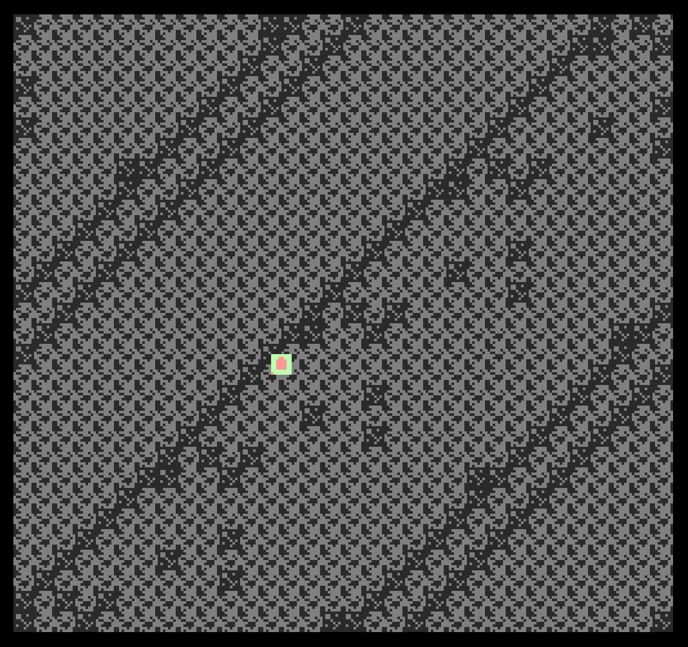

# Time

Author: Alexander Su

Design: A timey puzzler...

Screen Shot:

How Your Asset Pipeline Works:

Sprites are differentiated from backgrounds for animation and multi-tiled sprite purposes. Sprites are sliced automatically and parsed into runtime format stored in global scope to be loaded into game objects when needed. There are also tilemaps that are just read line by line and reference the parsed tiles.

How To Play:

General side scroller movement.

This game was built with [NEST](NEST.md).

